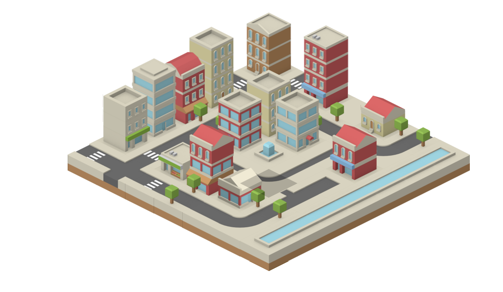

# IsoCity

An isometric city builder in JavaScript

[Live version](https://victorribeiro.com/isocity)

[Alternative link](https://victorqribeiro.github.io/isocity/)

## About

A simple JavaScript city builder with no simulation at all. No budget, no goals. Just build your tiny city. This would work on a phone, but it wasn't designed with phones in mind.

## Texture Credits

Textures from - [http://www.kenney.nl](https://opengameart.org/users/kenney)

------

